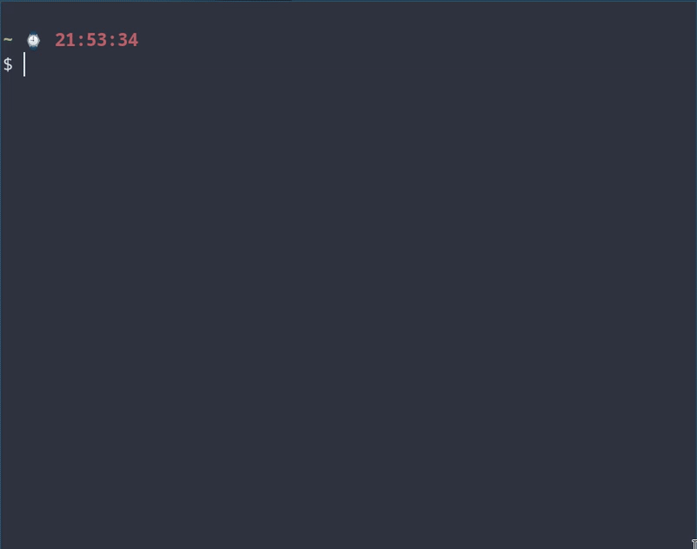

# tmuxa
This is a tmux wrapper writting in bash and another one writting in rust.
The tmux wrapper is good for managed tmux session. 

# New tmuxa
the new tmuxa is writting in rust and can be installed with:
```
cargo install --git https://github.com/kepet19/tmuxa.git
```

# Features
- Support for spaces
- Create a tmux session
- deleting a tmux sesssion

# Use case preview of the rust version
```
$ tmuxa
```

